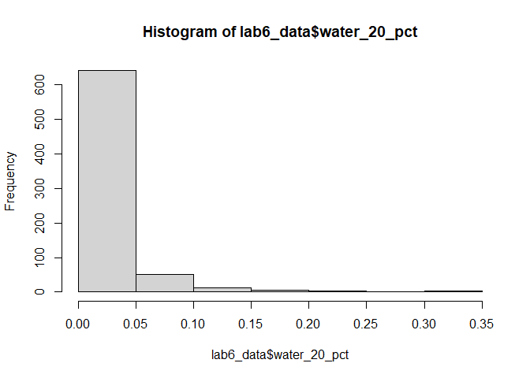

Geog6300: Lab 6
================

## Regression

``` r
#install.packages(car)
library(sf)
library(tidyverse)
library(tmap)
library(car)
```

**Overview:** This lab focuses on regression techniques. You’ll be
analyzing the association of various physical and climatological
characteristics in Australia with observations of several animals
recorded on the citizen science app iNaturalist.

\###Data and research questions###

Let’s import the dataset.

``` r
lab6_data<-st_read("data/aus_climate_inat.gpkg")
```

    ## Reading layer `aus_climate_inat' from data source 
    ##   `C:\Users\durki\OneDrive - University of Georgia\geog4-6300-lab-6-led84851\data\aus_climate_inat.gpkg' 
    ##   using driver `GPKG'
    ## Simple feature collection with 716 features and 22 fields
    ## Geometry type: POLYGON
    ## Dimension:     XY
    ## Bounding box:  xmin: 113.875 ymin: -43.38632 xmax: 153.375 ymax: -11.92074
    ## Geodetic CRS:  WGS 84 (CRS84)

``` r
lab6_data<-st_as_sf(lab6_data,coords=c(x="longitud",y="latitude"),crs=4326)
```

The dataset for this lab is a 1 decimal degree hexagon grid that has
aggregate statistics for a number of variables:

- ndvi: NDVI/vegetation index values from Landsat data (via Google Earth
  Engine). These values range from -1 to 1, with higher values
  indicating more vegetation.
- maxtemp_00/20_med: Median maximum temperature (C) in 2000 or 2020
  (data from SILO/Queensland government)
- mintemp_00/20_med: Median minimum temperature (C) in 2020 or 2020
  (data from SILO/Queensland government)
- rain_00/20_sum: Total rainfall (mm) in 2000 or 2020 (data from
  SILO/Queensland government)
- pop_00/20: Total population in 2000 or 2020 (data from NASA’s Gridded
  Population of the World)
- water_00/20_pct: Percentage of land covered by water at some point
  during the year in 2000 or 2020
- elev_med: Median elevation (meters) (data from the Shuttle Radar
  Topography Mission/NASA)

There are also observation counts from iNaturalist for several
distinctively Australian animal species: the central bearded dragon, the
common emu, the red kangaroo, the agile wallaby, the laughing
kookaburra, the wombat, the koala, and the platypus.

Our primary research question is how the climatological/physical
variables in our dataset are predictive of the NDVI value. We will build
models for 2020 as well as the change from 2000 to 2020. The second is
referred to as a “first difference” model and can sometimes be more
useful for identifying causal mechanisms.

\###Part 1: Analysis of 2020 data###

We will start by looking at data for 2020.

**Question 1** *Create histograms for NDVI, max temp., min temp., rain,
and population, and water in 2020 as well as elevation. Based on these
graphs, assess the normality of these variables.*

``` r
hist(lab6_data$ndvi_20_med)
```

<!-- -->

``` r
ggplot(lab6_data,aes(sample=ndvi_20_med))+
  stat_qq()+stat_qq_line()
```

<!-- -->

``` r
hist(lab6_data$maxtemp_20_med)
```

<!-- -->

``` r
ggplot(lab6_data,aes(sample=maxtemp_20_med))+
  stat_qq()+stat_qq_line()
```

<!-- -->

``` r
hist(lab6_data$mintemp_20_med)
```

<!-- -->

``` r
ggplot(lab6_data,aes(sample=mintemp_20_med))+
  stat_qq()+stat_qq_line()
```

<!-- -->

``` r
hist(lab6_data$rain_20_sum)
```

<!-- -->

``` r
ggplot(lab6_data,aes(sample=rain_20_sum))+
  stat_qq()+stat_qq_line()
```

<!-- -->

``` r
hist(lab6_data$pop_20)
```

<!-- -->

``` r
ggplot(lab6_data,aes(sample=pop_20))+
  stat_qq()+stat_qq_line()
```

<!-- -->

``` r
hist(lab6_data$water_20_pct)
```

<!-- -->

``` r
ggplot(lab6_data,aes(sample=water_20_pct))+
  stat_qq()+stat_qq_line()
```

<!-- -->

``` r
hist(lab6_data$elev_med)
```

<!-- -->

``` r
ggplot(lab6_data,aes(sample=elev_med))+
  stat_qq()+stat_qq_line()
```

<!-- -->

NDVI had a right skewed histogram and did not display normality. The max
temperature histogram was left skewed and the qq line looked more normal
than the NDVI line. Minimum temperature had a someone uniform histogram,
slightly skewed left. It’s qq line was somewhat normal as well. Rain was
significantly skewed right. Population and water were extremely skewed
right. Elevation was somewhat normal, slightly skewed right.

**Question 2** *Use tmap to map these same variables using Jenks natural
breaks as the classification method. For an extra challenge, use
`tmap_arrange` to plot all maps in a single figure.*

``` r
map1 <- tm_shape(lab6_data) +
  tm_polygons("ndvi_20_med",size=.2,style = "jenks")

map2 <- tm_shape(lab6_data) +
  tm_polygons("maxtemp_20_med",size=.2,style = "jenks")

map3 <- tm_shape(lab6_data) +
  tm_polygons("mintemp_20_med",size=.2,style = "jenks")

map4 <- tm_shape(lab6_data) +
  tm_polygons("rain_20_sum",size=.2,style = "jenks")

map5 <- tm_shape(lab6_data) +
  tm_polygons("pop_20",size=.2,style = "jenks")

map6 <- tm_shape(lab6_data) +
  tm_polygons("water_20_pct",size=.2,style = "jenks")

map7 <- tm_shape(lab6_data) +
  tm_polygons("elev_med",size=.2,style = "jenks")

tmap_arrange(map1, map2, map3, map4, map5, map6, map7)
```

    ## Variable(s) "elev_med" contains positive and negative values, so midpoint is set to 0. Set midpoint = NA to show the full spectrum of the color palette.

    ## Legend labels were too wide. The labels have been resized to 0.56, 0.56, 0.56, 0.56, 0.56. Increase legend.width (argument of tm_layout) to make the legend wider and therefore the labels larger.
    ## Legend labels were too wide. The labels have been resized to 0.56, 0.56, 0.56, 0.56, 0.56. Increase legend.width (argument of tm_layout) to make the legend wider and therefore the labels larger.

    ## Legend labels were too wide. The labels have been resized to 0.48, 0.44, 0.41, 0.41, 0.41. Increase legend.width (argument of tm_layout) to make the legend wider and therefore the labels larger.

    ## Some legend labels were too wide. These labels have been resized to 0.48, 0.44, 0.41, 0.41. Increase legend.width (argument of tm_layout) to make the legend wider and therefore the labels larger.

    ## Legend labels were too wide. The labels have been resized to 0.56, 0.56, 0.56, 0.56, 0.56. Increase legend.width (argument of tm_layout) to make the legend wider and therefore the labels larger.

    ## Variable(s) "elev_med" contains positive and negative values, so midpoint is set to 0. Set midpoint = NA to show the full spectrum of the color palette.

    ## Some legend labels were too wide. These labels have been resized to 0.64. Increase legend.width (argument of tm_layout) to make the legend wider and therefore the labels larger.

<!-- -->

**Question 3** *Based on the maps from question 3, summarise major
patterns you see in the spatial distribution of these data from any of
your variables of interest. How do they appear to be associated with the
NDVI variable?*

Overall, temperature seemed to increase as you go north. Rainfall was
higher on coastal regions, as is the population. Elevation was higher in
the southeast and western regions. The largest regions covered in water
were more central and near the coast, mainly in the east. The NDVI
variable seemed to follow a similar pattern to increased rainfall, near
the coastal regions and especially in the southeast. This was also in
the coolest part of the country. The vegetation does not seem to be
associated with the other variables as much.

**Question 4** *Create univariate models for each of the variables
listed in question 1, with NDVI in 2020 as the dependent variable. Print
a summary of each model. Write a summary of those results that indicates
the direction, magnitude, and significance for each model coefficient.*

``` r
model1<-lm(ndvi_20_med~maxtemp_20_med,data=lab6_data)
summary(model1)
```

    ## 
    ## Call:
    ## lm(formula = ndvi_20_med ~ maxtemp_20_med, data = lab6_data)
    ## 
    ## Residuals:
    ##      Min       1Q   Median       3Q      Max 
    ## -0.41874 -0.07657 -0.01927  0.06833  0.36382 
    ## 
    ## Coefficients:
    ##                  Estimate Std. Error t value Pr(>|t|)    
    ## (Intercept)     0.6612389  0.0294372   22.46   <2e-16 ***
    ## maxtemp_20_med -0.0130902  0.0009601  -13.63   <2e-16 ***
    ## ---
    ## Signif. codes:  0 '***' 0.001 '**' 0.01 '*' 0.05 '.' 0.1 ' ' 1
    ## 
    ## Residual standard error: 0.1251 on 714 degrees of freedom
    ## Multiple R-squared:  0.2066, Adjusted R-squared:  0.2055 
    ## F-statistic: 185.9 on 1 and 714 DF,  p-value: < 2.2e-16

``` r
model2<-lm(ndvi_20_med~mintemp_20_med,data=lab6_data)
summary(model2)
```

    ## 
    ## Call:
    ## lm(formula = ndvi_20_med ~ mintemp_20_med, data = lab6_data)
    ## 
    ## Residuals:
    ##      Min       1Q   Median       3Q      Max 
    ## -0.36375 -0.08418 -0.03047  0.06972  0.40383 
    ## 
    ## Coefficients:
    ##                 Estimate Std. Error t value Pr(>|t|)    
    ## (Intercept)     0.464461   0.018997   24.45   <2e-16 ***
    ## mintemp_20_med -0.012282   0.001131  -10.86   <2e-16 ***
    ## ---
    ## Signif. codes:  0 '***' 0.001 '**' 0.01 '*' 0.05 '.' 0.1 ' ' 1
    ## 
    ## Residual standard error: 0.1301 on 714 degrees of freedom
    ## Multiple R-squared:  0.1418, Adjusted R-squared:  0.1406 
    ## F-statistic:   118 on 1 and 714 DF,  p-value: < 2.2e-16

``` r
model3<-lm(ndvi_20_med~rain_20_sum,data=lab6_data)
summary(model3)
```

    ## 
    ## Call:
    ## lm(formula = ndvi_20_med ~ rain_20_sum, data = lab6_data)
    ## 
    ## Residuals:
    ##      Min       1Q   Median       3Q      Max 
    ## -0.56681 -0.04753 -0.01210  0.04599  0.30930 
    ## 
    ## Coefficients:
    ##              Estimate Std. Error t value Pr(>|t|)    
    ## (Intercept) 1.303e-01  7.060e-03   18.45   <2e-16 ***
    ## rain_20_sum 9.124e-07  3.953e-08   23.08   <2e-16 ***
    ## ---
    ## Signif. codes:  0 '***' 0.001 '**' 0.01 '*' 0.05 '.' 0.1 ' ' 1
    ## 
    ## Residual standard error: 0.1063 on 714 degrees of freedom
    ## Multiple R-squared:  0.4273, Adjusted R-squared:  0.4265 
    ## F-statistic: 532.6 on 1 and 714 DF,  p-value: < 2.2e-16

``` r
model4<-lm(ndvi_20_med~pop_20,data=lab6_data)
summary(model4)
```

    ## 
    ## Call:
    ## lm(formula = ndvi_20_med ~ pop_20, data = lab6_data)
    ## 
    ## Residuals:
    ##      Min       1Q   Median       3Q      Max 
    ## -0.47003 -0.07883 -0.03949  0.06384  0.48974 
    ## 
    ## Coefficients:
    ##              Estimate Std. Error t value Pr(>|t|)    
    ## (Intercept) 2.552e-01  5.013e-03  50.902   <2e-16 ***
    ## pop_20      1.500e-06  1.500e-07   9.998   <2e-16 ***
    ## ---
    ## Signif. codes:  0 '***' 0.001 '**' 0.01 '*' 0.05 '.' 0.1 ' ' 1
    ## 
    ## Residual standard error: 0.1316 on 714 degrees of freedom
    ## Multiple R-squared:  0.1228, Adjusted R-squared:  0.1216 
    ## F-statistic: 99.97 on 1 and 714 DF,  p-value: < 2.2e-16

``` r
model5<-lm(ndvi_20_med~water_20_pct,data=lab6_data)
summary(model5)
```

    ## 
    ## Call:
    ## lm(formula = ndvi_20_med ~ water_20_pct, data = lab6_data)
    ## 
    ## Residuals:
    ##      Min       1Q   Median       3Q      Max 
    ## -0.26898 -0.08838 -0.04838  0.06871  0.50911 
    ## 
    ## Coefficients:
    ##               Estimate Std. Error t value Pr(>|t|)    
    ## (Intercept)   0.268988   0.006287  42.781   <2e-16 ***
    ## water_20_pct -0.178263   0.154480  -1.154    0.249    
    ## ---
    ## Signif. codes:  0 '***' 0.001 '**' 0.01 '*' 0.05 '.' 0.1 ' ' 1
    ## 
    ## Residual standard error: 0.1403 on 714 degrees of freedom
    ## Multiple R-squared:  0.001862,   Adjusted R-squared:  0.0004636 
    ## F-statistic: 1.332 on 1 and 714 DF,  p-value: 0.2489

``` r
model6<-lm(ndvi_20_med~elev_med,data=lab6_data)
summary(model6)
```

    ## 
    ## Call:
    ## lm(formula = ndvi_20_med ~ elev_med, data = lab6_data)
    ## 
    ## Residuals:
    ##      Min       1Q   Median       3Q      Max 
    ## -0.27082 -0.09585 -0.04270  0.07954  0.44272 
    ## 
    ## Coefficients:
    ##              Estimate Std. Error t value Pr(>|t|)    
    ## (Intercept) 2.138e-01  9.741e-03  21.952  < 2e-16 ***
    ## elev_med    1.787e-04  2.895e-05   6.171 1.14e-09 ***
    ## ---
    ## Signif. codes:  0 '***' 0.001 '**' 0.01 '*' 0.05 '.' 0.1 ' ' 1
    ## 
    ## Residual standard error: 0.1369 on 714 degrees of freedom
    ## Multiple R-squared:  0.05064,    Adjusted R-squared:  0.04931 
    ## F-statistic: 38.08 on 1 and 714 DF,  p-value: 1.136e-09

For every one unit increase of median maximum temperature 2020, NDVI
decreases by 0.013, which is somewhat high. The p-value for the slope
indicates the relationship is highly significant. The R-squared value is
somewhat low (0.21), meaning NDVI cannot be heavily explained by maximum
temp. For every one unit increase of median minimum temperature 2020,
NDVI decreases by 0.012. This is very similar to the maximum temperature
variable, so it is likely these two variables have similar trends with
NDVI. It was statistically significant and the R-squared value was also
low (0.14). For every one unit increase in rainfall 2020, NDVI increases
by 9.124e-07, which is pretty small. This value was statistically
significant and the R-squared value was somewhat high (0.43), therefore
NDVI can be somewhat explained by rainfall. For every one unit increase
in population, NDVI increases by 1.500e-06, which is very small. The
value is statistically significant. The R-squared value is somewhat low
(0.12) which means we cannot say that NDVI is explained by population.
For every one unit increase of percentage of land covered by water, NDVI
decreases by 0.18, which is a somewhat high increase. The p-value level
is high, so there is insufficient evidence that these two variables are
associated. For every one unit increase of elevation, NDVI increases by
1.787e-04. The relationship is highly significant although R-squared
value is somewhat low, meaning we cannot say that NDVI can be explained
by elevation.

**Question 5** *Create a multivariate regression model with the
variables of interest, choosing EITHER max or min temperature (but not
both) You may also choose to leave out any variables that were
insignificant in Q4. Use the univariate models as your guide. Call the
results.*

``` r
model_all<-lm(ndvi_20_med~maxtemp_20_med + rain_20_sum + pop_20 + elev_med, data = lab6_data)
summary(model_all)
```

    ## 
    ## Call:
    ## lm(formula = ndvi_20_med ~ maxtemp_20_med + rain_20_sum + pop_20 + 
    ##     elev_med, data = lab6_data)
    ## 
    ## Residuals:
    ##      Min       1Q   Median       3Q      Max 
    ## -0.50217 -0.02838  0.00409  0.03919  0.20570 
    ## 
    ## Coefficients:
    ##                  Estimate Std. Error t value Pr(>|t|)    
    ## (Intercept)     4.571e-01  2.194e-02  20.828  < 2e-16 ***
    ## maxtemp_20_med -1.170e-02  6.796e-04 -17.220  < 2e-16 ***
    ## rain_20_sum     8.469e-07  3.263e-08  25.953  < 2e-16 ***
    ## pop_20          2.862e-07  1.044e-07   2.741  0.00627 ** 
    ## elev_med        1.233e-04  1.796e-05   6.864 1.46e-11 ***
    ## ---
    ## Signif. codes:  0 '***' 0.001 '**' 0.01 '*' 0.05 '.' 0.1 ' ' 1
    ## 
    ## Residual standard error: 0.0845 on 711 degrees of freedom
    ## Multiple R-squared:  0.6397, Adjusted R-squared:  0.6376 
    ## F-statistic: 315.5 on 4 and 711 DF,  p-value: < 2.2e-16

**Question 6** *Summarize the results of the multivariate model. What
are the direction, magnitude, and significance of each coefficient? How
did it change from the univariate models you created in Q4 (if at all)?
What do the R2 and F-statistic values tell you about overall model fit?*

The variables follow a similar pattern to the univariate models in terms
of direction. The magnitude for the variables decreased a little. They
are still statistically significant, except the population variable
rised some. The R-squared value increased to 0.64, which means the data
is more reliable and NDVI is pretty well explained by the variables. The
F-statistic value is highly significant so the model can explain the
variation in NDVI.

**Question 7** *Use a histogram and a map to assess the normality of
residuals and any spatial autocorrelation. Summarise any notable
patterns that you see.*

``` r
residuals <- residuals(model_all)
hist(residuals)
```

<!-- -->

The histogram displays a somewhat normal distribution in a specific
region, it looks like there is some values further to the left so the
data is skewed left.

**Question 8** *Assess any issues with multicollinearity or
heteroskedastity in this model using the techniques shown in class. Run
the appropriate tests and explain what their results show you.*

``` r
vif(model_all)
```

    ## maxtemp_20_med    rain_20_sum         pop_20       elev_med 
    ##       1.098705       1.078449       1.173863       1.009305

The values in the model are all below 5, indicating there is no
multicollinearity or correlation between two variables.

**Question 9** *How would you summarise the results of this model in a
sentence or two? In addition, looking at the full model and your
diagnostics, do you feel this is a model that provides meaningful
results? Explain your answer.*

The model is reliable since it shows no multicollinearity, as all the
values are below 5. The variables are all statistically significant so
the model provides meaningful results.

**Disclosure of assistance:** *Besides class materials, what other
sources of assistance did you use while completing this lab? These can
include input from classmates, relevant material identified through web
searches (e.g., Stack Overflow), or assistance from ChatGPT or other AI
tools. How did these sources support your own learning in completing
this lab?*

I used Google to help me undertstand the meaning of multicollinearity. I
also used ChatGPT to figure out how to take the residuals from the data
to create the histogram.

**Lab reflection:** *How do you feel about the work you did on this lab?
Was it easy, moderate, or hard? What were the biggest things you learned
by completing it?*

The lab was moderately difficult, I learned more about how to read and
interpret the summary from the models.

**Challenge question**

\#Option 1 Create a first difference model. To do that, subtract the
values in 2000 from the values in 2020 for each variable for which that
is appropriate. Then create a new model similar to the one you created
in question 5, but using these new variables showing the *change in
values* over time. Call the results of the model, and interpret the
results in the same ways you did above. Also chart and map the residuals
to assess model error. Finally, write a short section that summarises
what, if anything, this model tells you.

``` r
maxtemp_dif <- lab6_data$maxtemp_20_med - lab6_data$maxtemp_00_med
mintemp_dif <- lab6_data$mintemp_20_med - lab6_data$mintemp_00_med
rain_dif <- lab6_data$rain_20_sum - lab6_data$rain_00_sum
ndvi_dif <- lab6_data$ndvi_20_med -  lab6_data$ndvi_00_med
water_dif <- lab6_data$water_20_pct - lab6_data$water_00_pct
pop_dif <- lab6_data$pop_20 - lab6_data$pop_00

model_all2 <- lm(ndvi_dif ~ maxtemp_dif + mintemp_dif + rain_dif + water_dif + pop_dif, data = lab6_data)
summary(model_all2)
```

    ## 
    ## Call:
    ## lm(formula = ndvi_dif ~ maxtemp_dif + mintemp_dif + rain_dif + 
    ##     water_dif + pop_dif, data = lab6_data)
    ## 
    ## Residuals:
    ##      Min       1Q   Median       3Q      Max 
    ## -0.56948 -0.02068  0.00079  0.02271  0.45407 
    ## 
    ## Coefficients:
    ##               Estimate Std. Error t value Pr(>|t|)    
    ## (Intercept) -2.152e-02  4.291e-03  -5.016 6.69e-07 ***
    ## maxtemp_dif  2.142e-03  2.489e-03   0.861     0.39    
    ## mintemp_dif -1.266e-02  2.809e-03  -4.506 7.74e-06 ***
    ## rain_dif     2.180e-07  3.878e-08   5.622 2.71e-08 ***
    ## water_dif   -1.959e-02  8.618e-02  -0.227     0.82    
    ## pop_dif     -1.424e-07  2.868e-07  -0.496     0.62    
    ## ---
    ## Signif. codes:  0 '***' 0.001 '**' 0.01 '*' 0.05 '.' 0.1 ' ' 1
    ## 
    ## Residual standard error: 0.06052 on 710 degrees of freedom
    ## Multiple R-squared:  0.1061, Adjusted R-squared:  0.09985 
    ## F-statistic: 16.86 on 5 and 710 DF,  p-value: 9.076e-16

``` r
residuals2 <- residuals(model_all2)
hist(residuals2)
```

<!-- -->

Maximum temperature and rainfall difference has a positive relationship
with NDVI difference. Minimum temperature, water, and population
difference all have a negative relationship with NDVI difference. The
negative relationship indicates that these variables have increased from
2000 to 2020 while the positive relationship suggest the variables have
decreased from 2000 to 2020. Changes in minimum temperature and rainfall
both were statistically significant, meaning they are the most reliable
variables. The R-squared value is somewhat small so the model only
explains 10.61% of variation of the NDVI difference. The model is not
reliable to detect variability. The F-statistic value however is
statistically significant.

\#Option 2 The animal data included in this dataset is an example of
count data, and usually we would use a Poisson or similar model for that
purpose. Let’s try it with regular OLS regression though. Create two
regression models to assess how the counts of two different animals
(say, koalas and emus) are associated with at least three of the
environmental/climatological variables given above. Be sure to use the
same independent variables in each model. Interpret the results of each
model and then explain the importance of any differences in the model
coefficients between them, focusing on direction, magnitude, and
significance.
